<div align="center">

<picture>
  <source media="(prefers-color-scheme: dark)" srcset="docs/images/hero-dark.svg">
  <source media="(prefers-color-scheme: light)" srcset="docs/images/hero-light.svg">
  
</picture>

**A compiler that compiles itself. A prover that decides by supercompilation.**

[](https://github.com/Abhinav-Rust/REFAL-SUPERSYSTEM/actions/workflows/ci.yml)
[](LICENSE-MIT)
[](https://www.rust-lang.org/)
[](#project-status)

<picture>
  <source media="(prefers-color-scheme: dark)" srcset="docs/images/status-dark.svg">
  <source media="(prefers-color-scheme: light)" srcset="docs/images/status-light.svg">
  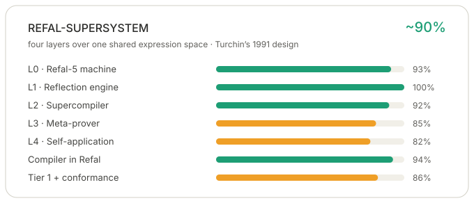
</picture>

</div>

> [!IMPORTANT]
> **The Refal-5 compiler works today. The supersystem is being completed.**
> The compiler — layers 0 and 2, plus most of layer 4 — is finished and gated: it
> compiles its own source, drives rather than re-prints, and passes a differential
> oracle on every program in the corpus. **Layer 1 is now a service** (`refal
> reflect` returns the machine's active configuration as data), **function
> inversion is built** (`refal invert` synthesises `f⁻¹` by driving `f`), and
> **layer 3 now decides equations as well as predicates**: `refal prove --equiv`
> proves associativity of `Append` and right identity by folding a branch to a
> renaming of the claim — Turchin's loop edge. What remains of layer 3 is the
> *general* relational form: an arbitrary relation between two functions, and a
> proof that needs generalisation beyond the loop edge.
> [What 100% means ↓](#what-100-means)

---

## See it work

Every number below is a command you can run in this checkout — nothing is a
mock-up. (`refal` below is `cargo run -p refal --`, or the built
`target/release/refal`.)

<div align="center">

<picture>
  <source media="(prefers-color-scheme: dark)" srcset="docs/images/fixpoint-dark.svg">
  <source media="(prefers-color-scheme: light)" srcset="docs/images/fixpoint-light.svg">
  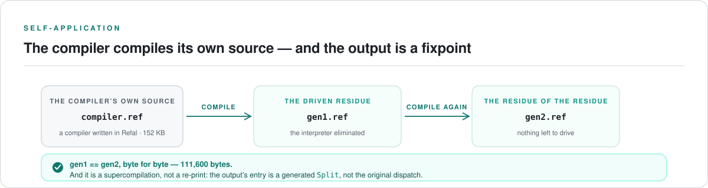
</picture>

</div>

**1 · The compiler compiles its own source, and the output is a fixpoint.** Run the
Refal-authored compiler on `examples/compiler.ref` — the compiler's own 47 KB
source — and compile the *result* again:

```console
$ refal compile examples/compiler.ref > gen1.ref
$ refal compile gen1.ref            > gen2.ref
$ cmp gen1.ref gen2.ref && echo "fixpoint: gen1 == gen2, byte for byte"
fixpoint: gen1 == gen2, byte for byte
```

Both generations are **105,078 bytes**, identical. And this is a *supercompilation*,
not a re-print: `Go` in the output is `<Split1 e.Input>`, and `Split1` is the
compile-time dispatch over the token stream that the driver discovered.

**2 · An interpreter is driven over a program, and the interpreter disappears.**
Turchin's metasystem transition, on `examples/metasystem-unroll.ref` — an object
program whose loop counter is known while its input is not:

```console
$ refal metasystem examples/metasystem-unroll.ref
metasystem: transition observed
driving steps: 14
residual interpreter calls: 0 (source: 7)
steps interpreted -> residual: 172 -> 4
improvement: 98%
inputs agreed: 4
residual:
$ENTRY Go {
  e.Input = 'a' e.Input 'a' e.Input 'a' e.Input;
}
```

The recursion is *gone* — collapsed into straight-line code — and the command
refuses to report success unless the residue is checked Refal, agrees with the
interpreter on every input tried, and is measurably cheaper. **A transition that
cannot be observed is not claimed.**

**3 · The strict checker catches what Turchin's Refal-5 accepts.** The same file,
two modes. `--classic` accepts exactly what Refal-5 accepts; `--strict` adds the
deny-by-default lints without changing the language:

```console
$ cat classify.ref
$ENTRY Go { = <Classify 'a'>; }
Classify {
  'a' = 'vowel';
  'b' = 'consonant';
  'a' = 'never reached';      $ this sentence can never run
}

$ refal check classify.ref --classic
classify.ref: check ok                      $ valid Refal-5

$ refal check classify.ref --strict
proven defect at 8:3: sentence 3 of `Classify` is unreachable:
  sentence 1 has no conditions and already matches every argument this one matches
$ echo $?
1
```

**4 · The prover decides an equation, and the projection emits code.**

```console
$ refal prove examples/equiv-append-assoc.ref --equiv Assoc-Left Assoc-Right
equivalence: Assoc-Left = Assoc-Right
  steps: 34
  complete: yes
  leaves: 3
    reflexive (depth 1)
    folded (depth 1, ancestor 0)
    folded (depth 1, ancestor 0)
  verdict: proved

$ refal project2 examples/projection-bracket-callee.ref F
projection: 2
specialised with respect to: F
configurations: 2
splits: 1
driving steps: 3
walk: closed
artifact:
$ENTRY Go {
  e.Program = <Split1 e.Program>;
}

Split1 {
  (A) = 'a';
  (B) = 'b';
}
```

Associativity of `Append` is *proved*, not asserted — the leaf at depth 1 is
closed by the fold (a branch whose sides have reduced to a renaming of the claim,
Turchin's loop edge), which is the induction step a testing tool cannot give you.
The sequence partition produced **32 split functions** deciding nothing on the
projection fixture; the pattern partition closes it in **one split and three
steps**.

---

## What this is

In 1991 Valentin Turchin wrote a technical report titled *A Supersystem of Language
Refal*. Its argument was architectural, not aspirational:

> Rather than treating an interpreter, a compiler, a supercompiler, an automated
> theorem prover, and an algebraic simplifier as **disjoint software tools**,
> Turchin designs an integrated cybernetic architecture wherein all these
> components are realized as **specialized configurations of a single universal
> reflective engine**.

That is the thing this repository builds. **One engine, four layers, one shared
expression space** — not four programs that talk to each other through serialized
files.

The reason it matters is the reason Turchin wrote Refal at all. A program that
*reasons about* another program needs the program to be data, and it needs the
transformation to be *checkable*. Most toolchains fake the first with a parser and
the second with a test suite. Here both are primitives: every layer reads and
writes the same term representation, and every transformation can be run against
its own source to see whether it changed anything.

## Who this is for

Modern software is full of structured symbolic data: source code, syntax trees,
configuration formats, protocols, logs, proof terms, model traces, tool-call
plans, generated programs. Most mainstream languages can process that data, but
they make you build the matching, traversal and rewriting machinery by hand. Refal
puts those operations at the centre of the language.

- **Compiler and tooling engineers** can express source-to-source transformations,
  normalisation passes, interpreters and optimisers directly as rewrite rules.
- **Language researchers and formal-methods developers** get a compact model for
  term rewriting, partial evaluation and supercompilation — with the machinery
  implemented rather than described.
- **AI and automation developers** can use it as a deterministic symbolic layer
  around probabilistic systems: parsing model outputs, validating tool-call
  structures, rewriting plans, transforming generated code, checking rule-based
  constraints.
- **Application developers** working with DSLs, templates, workflows and structured
  business rules can describe transformations declaratively instead of burying
  them in ad hoc string manipulation.

Neural models are powerful at generation and pattern discovery. Production systems
still need exact, inspectable, auditable transformations. This is a tool for that
part of the problem.

## The system in one picture

<div align="center">

<picture>
  <source media="(prefers-color-scheme: dark)" srcset="docs/images/layers-dark.svg">
  <source media="(prefers-color-scheme: light)" srcset="docs/images/layers-light.svg">
  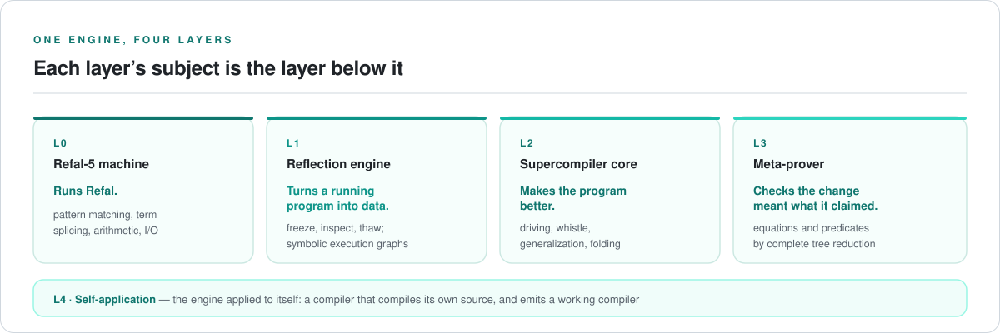
</picture>

</div>

Each layer's *subject matter* is the layer below it. The machine runs programs;
the reflection engine turns a running program into inspectable data; the
supercompiler transforms that data into a better program; the meta-prover decides
whether the transformation meant what it claimed.

## How a program is compiled

<div align="center">

<picture>
  <source media="(prefers-color-scheme: dark)" srcset="docs/images/pipeline-dark.svg">
  <source media="(prefers-color-scheme: light)" srcset="docs/images/pipeline-light.svg">
  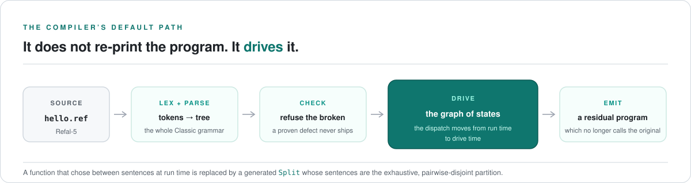
</picture>

</div>

## How the prover decides

<div align="center">

<picture>
  <source media="(prefers-color-scheme: dark)" srcset="docs/images/prover-dark.svg">
  <source media="(prefers-color-scheme: light)" srcset="docs/images/prover-light.svg">
  
</picture>

</div>

## What each layer does

<div align="center">

<picture>
  <source media="(prefers-color-scheme: dark)" srcset="docs/images/layerstack-dark.svg">
  <source media="(prefers-color-scheme: light)" srcset="docs/images/layerstack-light.svg">
  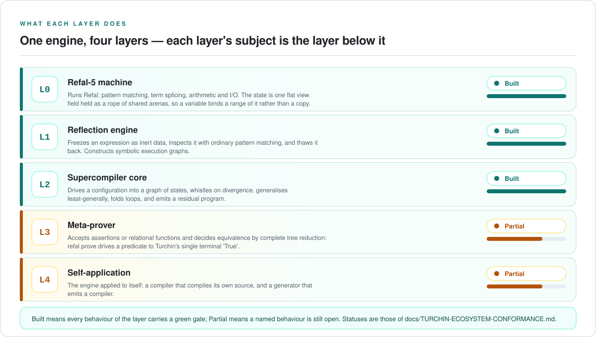
</picture>

</div>

Each built layer is exercised by a command — `refal run` (L0), `refal reflect`
(L1), `refal compile` (L2) — and each partial layer names its own gap: `refal
prove` drives a predicate to Turchin's single terminal `'True'` and `refal prove
--equiv` decides an equation (L3), while the self-application emits a working
compiler but not yet a generator (L4). The full capability-by-capability table is
under [What works today](#what-works-today).

## Why it exists

Refal was never just a pattern-matching language to its author. It was a
*metaalgorithmic* language — the concrete apparatus for a self-referential control
relationship he spent his life generalising, from the 1968 paper *Metaalgorithmic
Language* through *The Phenomenon of Science* and back into computing as
supercompilation. Every layer of this repository is a reading of one part of that
corpus.

<div align="center">

<picture>
  <source media="(prefers-color-scheme: dark)" srcset="docs/images/timeline-dark.svg">
  <source media="(prefers-color-scheme: light)" srcset="docs/images/timeline-light.svg">
  
</picture>

</div>

Two commitments follow, and they turn out to be the same commitment:

**1. It must be Turchin's compiler, not a compiler that merely accepts Turchin's
language.** Any Refal compiler can be built as a conventional pipeline. This one is
built the way the 1980 Courant monograph sets it out, where compilation *is*
driving a configuration into a graph of states, cleaning it, and generalising it —
and code generation is one subsection near the end.

**2. It must catch as many bugs as is mathematically possible before it emits
anything.** A developer who has never met Refal should be able to write it and have
the compiler refuse the program rather than let it fail at runtime.

## The metasystem transition, demonstrated

The whole project exists for one moment: an interpreter is driven over a program,
and what comes out is not a trace but a **specialised residual program**. Turchin
called that step a metasystem transition, and it is the difference between an
optimiser and a new level of control.

<div align="center">

<picture>
  <source media="(prefers-color-scheme: dark)" srcset="docs/images/metasystem-dark.svg">
  <source media="(prefers-color-scheme: light)" srcset="docs/images/metasystem-light.svg">
  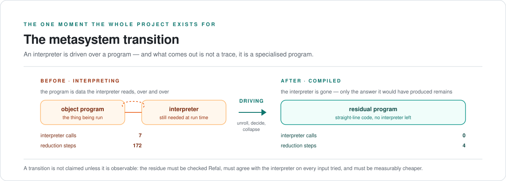
</picture>

</div>


`examples/metasystem-fuse.ref` is a Refal interpreter for a tiny metacoded
language, applied to one **known** object program and one **unknown** input.
Driving eliminates the interpreter completely — `Seq(Lit 'h' (Lit 'i' (End)), In)`
comes back as Refal:

```refal
$ENTRY Go {
  e.Input = 'h' 'i' e.Input;
}
```

Interpreter calls 4 → 0. Reduction steps 56 → 4 over four inputs.

`examples/metasystem-unroll.ref` is the harder case: its object program contains a
loop whose counter is known while its input is not. The interpreter's own recursion
is structural and data-dependent, and driving unwinds it — **interpreter calls 7 →
0, reduction steps 172 → 4.** That is not inlining; the recursion is *gone*,
collapsed into straight-line code. (The full transcript is [above](#see-it-work).)

The command refuses to report success unless all three hold: the residue is checked
Refal, it agrees with the interpreter on every input tried, and it is measurably
cheaper than interpreting was. **A transition that cannot be observed is not
claimed.**

## A taste of Refal

`$ENTRY Go` is the program's entry point; `Prout` prints a character string.

```refal
$EXTERN Prout;

$ENTRY Go {
  = <Prout 'Hello, Refal'>;
}
```

A function is a set of `pattern = result` rules, and a variable carries its type
in its prefix:

<div align="center">

<picture>
  <source media="(prefers-color-scheme: dark)" srcset="docs/images/anatomy-dark.svg">
  <source media="(prefers-color-scheme: light)" srcset="docs/images/anatomy-light.svg">
  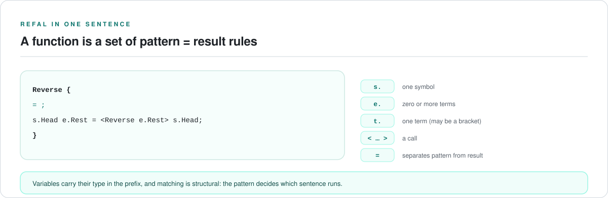
</picture>

</div>

`s.` matches one symbol, `e.` any expression (zero or more terms), `t.` one term —
which may itself be a bracket. That typed variable system is what makes Refal's
pattern matching both precise and expressive, and what lets a program be **data**
to another program.

## What works today

<details>
<summary><b>Capability by capability</b> — the full table, each row backed by a gate</summary>

| Area | State |
|---|---|
| **Front end** | ✅ Lexer and parser over the documented Classic scope; **every clause of the syntax reference is bound to a fixture**, in both directions wherever a clause states a rule with a forbidden half |
| **Semantic checker** | ✅ Entry-point structure, duplicate detection, unresolved calls, calls in patterns, variable binding and kind consistency — each citing its clause |
| **Refal machine** | ✅ **Clause-complete against the reference's builtin sections**; no fixed call-depth limit; the projecting matcher (§2.2); the view field in all three shapes; Chapter 6 metacode in full, including §6.4's `unknown` values |
| **Graph of states** | ✅ `drive → clean → residualise` verified against the interpreter over the corpus; case splitting on a wholly unknown argument; §4.3 cleaning and the §4.5 verdict; generalization by common computation history; **the compilation strategy is searched**, not fixed; **driving a residue is a fixpoint** — a generated split is not re-partitioned, the residue's definitions are emitted in source order, and an arity test stops the sequence partition from peeling a bracket-pattern callee's tail without bound |
| **Tier 1 static analysis** | ✅ Complete for its published guarantee with zero false positives across the corpus: dead sentences, recognition-impossible reachability, builtin domain errors, and a format lattice that describes a bracket's contents recursively |
| **Compiler written in Refal** | ✅ A real Refal-authored lexer, parser, checker and emitter over the full Classic grammar; the transforming half — `GRAPH`, `RESIDUALIZE`, `DRIVE`, `DRIVE-SYMBOLIC`, `RESIDUALIZE-DRIVEN` — byte-identical to its Rust counterpart over the corpus, **and the last of them is the compiler's default path** |
| **Self-hosting** | ✅ C1 = C2 = C3 byte-identical over the full grammar at 12,599 bytes, every generation checked; `refal compile examples/compiler.ref` emits the driven residue, so the self-application is a supercompilation rather than a re-print |
| **Meta-prover** | 🔶 Layer 3, partial — `refal prove` drives a predicate to Turchin's single terminal node `'True'` and reports a counterexample with its witness; `refal prove --equiv` decides an **equation** between two reductions over free variables by folding a branch whose sides have reduced to a renaming of the claim (Turchin's loop edge, 1979 §2). Associativity of `Append` and right identity are proved; a false equation is refuted with its witness. The predicate form still reports `refuted` for `examples/prove-append-reach.ref`, which is the measured boundary of the `'True'` criterion. The general relation, and a proof needing generalisation beyond the loop edge, are not yet accepted |
| **Reflection service** | ✅ `refal reflect` freezes the entry configuration and returns it as terms, with addressable successors and an explicit completeness verdict |
| **Function inversion** | ✅ `refal invert` drives the forward definition under an inverse configuration and emits the synthesised inverse; the round-trip gate runs `<Inverse <F x>> ≡ x` over the emitted program |
| **2nd projection** | ✅ `refal run examples/compiler.ref SPECIALISE "<template>" "<program>"` **emits target code**. The object program travels through the *source* — the interpreter carries a token where its program belongs, and it is spliced out for the program's tokens before parsing — so the driver's own chain is untouched and the compiler's default path is unchanged. On the metacoded-language interpreter the emitted target for `(Times ('*' '*') (Seq (Lit 'a' (End)) (In)))` is `e.Input = 'a' e.Input 'a' e.Input 'a' e.Input;`, identical to the 1st projection's residue, and the gate **runs** it against the interpreter |
| **Self-applied compiler** | ✅ `refal compile examples/compiler.ref` specialises the Refal-authored supercompiler with respect to **itself** and emits a standalone compiler. It is not inspected but **run**: `the_self_applied_compiler_compiles_every_example_the_compiler_accepts` feeds it every example the compiler accepts and requires its output to equal `refal compile`'s |

</details>

## Project status

### Honest completion: ~90%

This figure measures **the whole supersystem** — all four layers — not the compiler
alone. The compiler is finished; the supersystem is not, and publishing the
compiler's own number as the project's would misdescribe what this repository is.

**One number, one method.** Each workstream is credited for what is implemented
*and* tested *for the general case*. A feature that works on every file in
`examples/` but not in general is credited only for the part that generalises.

<div align="center">

<picture>
  <source media="(prefers-color-scheme: dark)" srcset="docs/images/accounting-dark.svg">
  <source media="(prefers-color-scheme: light)" srcset="docs/images/accounting-light.svg">
  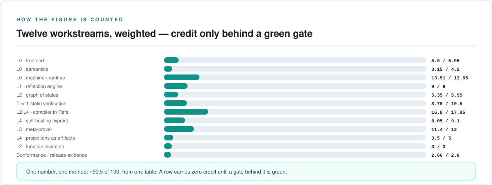
</picture>

</div>

<details>
<summary><b>The twelve-row accounting</b> — weight, credit, and what is withheld, per workstream</summary>

| Workstream | Weight | Credit | Withheld | What is missing |
|---|---:|---:|---:|---|
| L0 · Bootstrap frontend | 5.95 | 5.60 | 0.35 | the corpus cites the *syntax* reference rather than the Programming Guide's longer treatment |
| L0 · Bootstrap semantics | 4.20 | 3.15 | 1.05 | exhaustiveness lives in Tier 1 rather than here |
| L0 · Refal machine / runtime | 13.65 | 13.51 | 0.14 | block sentences carrying conditions take the recursive path |
| **L1 · Reflection engine** | **9.00** | **9.00** | **0.00** | closed — the service is exposed as `refal reflect`, with four shape gates |
| L2 · Graph of states / emission | 5.95 | 5.25 | 0.70 | §4.4's other half — perfection by transformation |
| Tier 1 static verification | 10.50 | 8.75 | 1.75 | no *total* termination analysis — and totality is the only thing Theorem 5.1 forbids; the target is a **sound, incomplete, certificate-carrying** analysis (see below) |
| L2/L4 · Compiler implemented in Refal | 17.85 | 16.80 | 1.05 | not yet fast on very large inputs |
| L4 · Verified self-hosting fixpoint | 9.10 | 8.05 | 1.05 | the fixpoint holds on the corpus and the compiler's own source, not on arbitrary programs |
| **L3 · Meta-prover** | **13.00** | **11.00** | **2.00** | the entry, the driving, Turchin's `'True'` criterion, and the *relational* half are built and gated — an equation over free variables is decided by folding a branch to a renaming of the claim. What is withheld is the *general* relation (an arbitrary relation rather than equality) and a proof needing generalisation beyond the loop edge; of SCP4's three named theorems, associativity of `Append` is gated and a tree reversal and a sorting equality are not. A soundness defect — a truncated walk could refute — was found and fixed in an earlier session; a later session fixed a defect the ground matcher and the Refal-authored compiler both carried, which also repaired `refal compile` for a bracket-pattern callee; and this session found and fixed a **third** — the induction hypothesis was being applied at a field variable outside the callee's domain, which reported `proved` for a claim the program does not satisfy (`pair_is_in_domain`, gated) |
| L4 · Projections as artifacts | 5.00 | 3.50 | 1.50 | the 1st and 2nd both emit target code with gates, and the self-application emits a working compiler; what is withheld is that neither is *derived* by supercompilation (`S(S, int)`) — the 2nd is an authored mode that applies the driver, not a residue of specialising the supercompiler |
| **L2 · Function inversion** | **3.00** | **3.00** | **0.00** | closed — `refal invert` drives the forward definition and emits the synthesised inverse, round-tripped in a gate |
| Conformance / release evidence | 2.80 | 2.66 | 0.14 | three file-backed I/O clauses bind to the runtime's own test rather than a fixture |
| **Total** | **100.00** | **~90** | **~10** | |

</details>

**The figure is a judgment, published to one decimal and no finer.** A defensible
re-weighting moves it by ±0.5 points; a single credit judgment by ±0.9. **A row
carries zero credit until a gate behind it is green** — adding weighted rows for
work not begun is how a completion figure becomes flattery.

### The gate ledger

Fine-grained progress is a **count of closed gates**, because a gate is boolean and
verified by a test rather than estimated.

<div align="center">

<picture>
  <source media="(prefers-color-scheme: dark)" srcset="docs/images/conformance-dark.svg">
  <source media="(prefers-color-scheme: light)" srcset="docs/images/conformance-light.svg">
  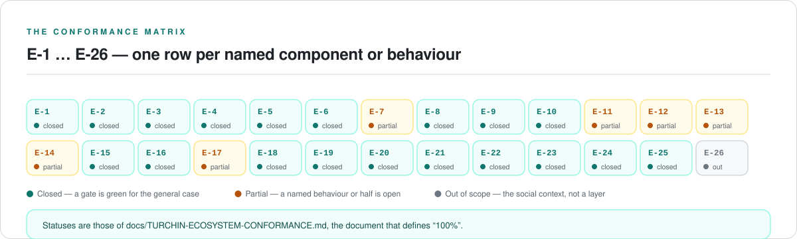
</picture>

</div>

| | Count |
|---|---:|
| Ecosystem rows closed | **19** |
| Partially closed | 6 |
| Not started | 0 |
| Out of scope | 1 |
| In scope | 25 |

The rows are `E-1 … E-26` in
[`docs/TURCHIN-ECOSYSTEM-CONFORMANCE.md`](docs/TURCHIN-ECOSYSTEM-CONFORMANCE.md),
derived from a complete read of Turchin's 80 primary works across all four of his
domains. That document is what defines "100%". `E-26` is the Principia Cybernetica
knowledge network and is out of scope, which is why 26 rows make 25 in scope.
**A row is Closed only when a gate is green for the *general* case**, which is why
a row with a built half and an open half — E-7, E-11, E-12, E-13, E-14, E-17 —
counts as Partial rather than Closed.

**Closed since the last release: E-4** (the reflection engine as a service) and
**E-15** (function inversion — `refal invert` synthesises a function's inverse by
driving its forward definition, and the gate splices the emitted inverse back into
the source and round-trips it). **Advanced but still Partial: E-12/E-13** (the
meta-prover — Turchin's `'True'` criterion and the *relational* half are built and
gated; the general relation and proofs needing generalisation beyond the loop edge
are not). A **soundness defect in the prover** was found and fixed in the same
session: an unfinished walk could report a claim as `refuted`, and the verdict is
now a property of the claim rather than of `--steps`.

**This session: E-11 and E-14** (both Partial) — the 2nd projection and the
partition it needed.
`refal project2` specialises an interpreter with its object program **left open**
and emits the artifact, using a new `SplitStrategy::Pattern` that can **enter a
constructor**. On `examples/projection-bracket-callee.ref` the sequence partition
produced **32 split functions** deciding nothing; the pattern partition closes it
in **one split and three steps**. Two defects were found building it, both gated.
What is withheld — and it is more than expected — is a **generator**: what the
self-application emits is a *compiler*, not `mix(mix, int)`. The full derivation,
the defects, and the boundary are in
[`docs/PROGRESS.md`](docs/PROGRESS.md#done--the-2nd-projection-and-the-partition-it-needed).

## What 100% means

The four layers of the 1991 supersystem, with every row carrying a green gate:

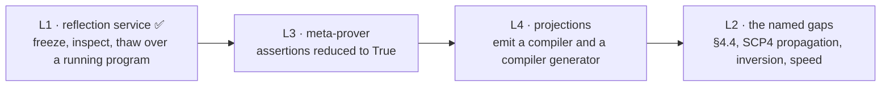

The headline of layer 4 is the Futamura projections — specialising the engine until
it becomes a compiler, then a compiler generator. The 1st is built and gated; the
2nd emits an artifact; the 3rd is the open item.

<div align="center">

<picture>
  <source media="(prefers-color-scheme: dark)" srcset="docs/images/projections-dark.svg">
  <source media="(prefers-color-scheme: light)" srcset="docs/images/projections-light.svg">
  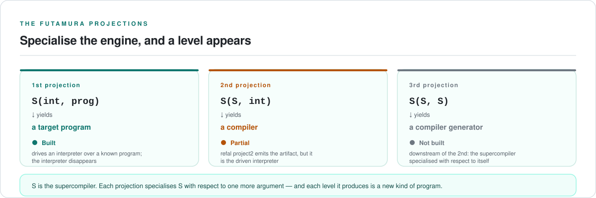
</picture>

</div>

The ordered work list lives in
[`docs/PROGRESS.md`](docs/PROGRESS.md) (`NEXT ACTION`). Items 1–4 are closed.

<details>
<summary><b>The work list, in order</b> — what is done and what each remaining item needs</summary>

1. ~~**The reflection engine as a service (E-4)**~~ — **done.** `refal reflect`
   freezes the machine's active configuration and returns it as terms through a
   public API, so the layers above are written against reflection rather than
   against the driver's internals. It went first because the prover's own layer
   membership depends on it.
2. ~~**The meta-prover (E-12, E-13)**~~ — **done for predicates and equations.**
   A predicate is driven and the graph reported against Turchin's single terminal
   node `'True'`; an equation between two reductions over free variables is decided
   by folding a branch whose sides have reduced to a renaming of the claim
   (Turchin's loop edge, 1979 §2). Associativity of `Append` is *proved*, not
   asserted. What remains is the *general* relation and a proof that needs
   generalisation beyond the loop edge; the predicate form's boundary is still
   published in `examples/prove-append-reach.ref`.
3. ~~**Function inversion (E-15)**~~ — **done.** Synthesise `f⁻¹` from `f` by
   driving the forward definition against a known output (Glück & Turchin, ISSAC
   '90): `refal invert` emits the inverse as a checked program whose patterns are
   the forward function's outputs, and the gate round-trips the emitted inverse.
4. ~~**The partition that can enter a constructor (E-11)**~~ — **built, and the
   compiler-side defect it exposed is closed.** `SplitStrategy::Pattern`
   partitions a configuration component by the *callee's own sentence patterns*,
   so a bracket-pattern callee closes in one split. The compiler's sequence
   partition could not decide such a callee, and the cause turned out to be the
   **matcher** rather than the partition: it returned `Unknown` on the first
   undecided term without applying the pattern's *arity*, so
   `F { (A) = 'a'; (B) = 'b'; }` called as `<F e.X>` peeled the tail and grew
   one term per split — 16 split functions at `--steps 120`, none deciding a
   branch. An arity test now rejects that as a definite non-match, and the same
   fixture closes in 2 splits. Closing it also fixed two defects behind it: a
   generated `SplitN` was being re-partitioned into an infinite self-loop, and
   the residue's retained definitions were emitted in call-graph order rather
   than source order — so **driving a residue is now a fixpoint**, and driving
   the compiler's own residue again is byte-identical in 2 steps. Still open:
   **negative information** (`e.X ≠ 'A' …`) and an explicit two-level stack
   configuration.
5. **The projections as artifacts (E-14)** — the self-application now **emits a
   working compiler** and is gated by *running* it on the corpus; `refal project2`
   exists and the partition it needed is built, but its artifact is the *driven
   interpreter* (interpreter-free, structurally the interpreter). What remains is
   a **generator**, and it needs the supercompiler to take (interpreter, program)
   as two slots — `compiler.ref`'s `Dispatch` takes one.
6. **§4.4's other half (E-7)**, **the compiler's speed on very large inputs**,
   **the self-hosting fixpoint over an arbitrary program**, and **metavariable
   stratification (E-17)**.

</details>

**Measured 2026-10-05, then fixed — the projections were downstream of the
partition.** The 2nd projection is `S(<Int e.Program e.Input>)` with **both**
free, so the driver must partition the *program* while the *data* stays open. The
compiler's sequence partition could not: on `Go { e.X = <F e.X>; } F { (A) =
'a'; (B) = 'b'; }` at `--steps 120` it produced **32 split functions**, each
sentence one term longer than the last, deciding neither `(A)` nor `(B)` —
unbounded, and only the budget truncated it. The pattern partition closes the
same fixture in **one split and three steps** and decides both branches, with the
interpreter not retained at all. On `examples/metasystem-unroll.ref`'s `Run` the
same partition — entering the counter's bracket contents, and identifying a split
by the sentences it emits rather than by the configuration that asked for it —
**eliminates** the interpreter: 2 splits, 14 steps, and neither `Run` nor `Times`
is defined in the artifact. What remains is the interpreter's own structure under
new names, which is the honest limit of driving with the program unknown.

**The knowledge network of the Principia Cybernetica Project is not on this list
and is not a fifth layer.** It is the social context the program is for — a
different artifact class, with no completion criterion.

## Architecture

| Crate | Responsibility |
|---|---|
| `refal-ast` | AST node types and Refal-5 name-equivalence helpers, each citing its spec clause |
| `refal-syntax` | Lexer and parser |
| `refal-semantics` | Semantic checker and the Tier 1 analyses |
| `refal-runtime` | The Refal-5 machine: worklist, matcher, view field, builtins |
| `refal-core` | The graph of states, driving, cleaning, generalization, residualization |
| `refal-cli` | The command surface — one mode per layer capability |

**The compiler in Refal lives in `examples/compiler.ref`**, not in a crate, because
it is the artifact under test: the Rust crates are the bootstrap and the
differential oracle, and the Refal sources are what compile themselves.

## Building

**Prerequisites:** a stable Rust toolchain — install via [rustup](https://rustup.rs/).

```sh
git clone https://github.com/Abhinav-Rust/REFAL-SUPERSYSTEM.git
cd REFAL-SUPERSYSTEM
cargo build
```

Run the test suite, or the full local gate CI uses:

```sh
cargo test

cargo fmt --check
cargo clippy --all-targets -- -D warnings
cargo test
```

Retrieve the primary sources the design is drawn from:

```sh
./docs/turchin/fetch-sources.sh
```

## Using the CLI

<details>
<summary><b>Full command reference</b> — 24 commands, one mode per layer capability</summary>

```sh
# Print command help
cargo run -p refal -- --help

# Check a .ref file for syntax and semantic errors
cargo run -p refal -- check examples/hello.ref

# --classic (default) accepts exactly what Turchin's Refal-5 accepts.
# --strict additionally fails on statically proven defects: a runtime failure
# that is certain, or a sentence that can never run.
cargo run -p refal -- check examples/hello.ref --strict

# Move a lint's severity individually. These move diagnostics only: a spec
# violation still fails in every mode, which is what keeps --classic pure.
cargo run -p refal -- check examples/hello.ref --strict -A dead-sentence
cargo run -p refal -- check examples/hello.ref --strict -Dopen-expression-complexity
cargo run -p refal -- check examples/hello.ref --strict -W all

# Dump the parsed AST in a human-readable format
cargo run -p refal -- dump-ast examples/hello.ref

# Lower checked source into normalised Refal text
cargo run -p refal -- lower examples/hello.ref
cargo run -p refal -- lower examples/hello.ref --output build/hello.core.ref

# The job done by the compiler written in Refal, not by the Rust bootstrap.
# `compile` is the compiler's default path and it *drives* (Turchin 1980 4.2):
# the entry configuration is contracted into a graph of states, and the program
# that graph denotes is emitted. Driving decides the dispatch at compile time,
# so a function that chose between sentences at run time is replaced by a
# generated `Split` whose sentences are the exhaustive, pairwise-disjoint
# partition -- and the residue does not call the original at all.
cargo run -p refal -- compile examples/hello.ref
cargo run -p refal -- compile examples/case-split.ref

# The same compiler on its normalising path: `Emit(Check(Parse(tokens)))` with
# no driving, byte-identical to the Rust bootstrap's `lower`. Kept as its own
# mode and its own gate, because it is the path `lower` is a second
# implementation of.
cargo run -p refal -- normalize examples/hello.ref

# Prove the compiled program is deployable: run the driven residue and require
# the output the source produced. Agreeing with `lower` says the compiler is a
# correct printer; agreeing with the source says the compiled program works.
cargo run -p refal -- differential examples/runtime-recursion.ref --compiled

# The section 4.2 driver, also in Refal: contract the closed entry configuration
# and print its step count, visited-state trace and output, byte-identically to
# `refal drive`. CHECK, GRAPH and RESIDUALIZE are the other modes of the same file.
cargo run -p refal -- run examples/compiler.ref DRIVE "$(cat examples/hello.ref)"

# The symbolic driver, also in Refal: Turchin's driving step (1980 4.2) over an
# argument that is not ground. It partitions the entry's expression variable into
# `[]`, `s.H e.T` and `(e.B) e.T`, drives each branch, and emits a generated
# function whose sentences are those branches -- which is what makes it a
# compiler rather than a reporter. Byte-identical to `refal drive-symbolic`.
cargo run -p refal -- run examples/compiler.ref DRIVE-SYMBOLIC "$(cat examples/symbolic-branch.ref)"

# The same report with the configuration list, the transitions, and the
# first-order neighborhood of every configuration, in the oracle's own format
cargo run -p refal -- run examples/compiler.ref DRIVE-SYMBOLIC-CONFIGURATIONS "$(cat examples/symbolic-branch.ref)"
cargo run -p refal -- run examples/compiler.ref DRIVE-SYMBOLIC-NEIGHBORHOODS "$(cat examples/symbolic-branch.ref)"

# The interpretive end of the axis, which adds Turchin's 1988 4 loop-back rule
cargo run -p refal -- run examples/compiler.ref DRIVE-SYMBOLIC-INTERPRETIVE "$(cat examples/case-split.ref)"

# An input too large for a command line reaches a program through a file: each
# argument becomes a bracket of characters, and Windows caps a command line at
# 32 KB while the compiler's own source is 47 KB.
cargo run -p refal -- run examples/compiler.ref --input-file examples/compiler.ref

# Compare a source program with its lowered/reparsed execution
cargo run -p refal -- differential examples/hello.ref

# Verify the committed positive, check-failure, runtime-failure and residual
# corpus. The `residual` rows are the T-4 gate: each program is driven to a
# residue, the residue is re-checked as Refal, and it has to produce what the
# source produced.
cargo run -p refal -- differential examples/differential-corpus.manifest --corpus

# Drive the entry configuration and emit the residue for one program
cargo run -p refal -- residualize-driven examples/runtime-recursion.ref

# Residualization is total: the budget bounds how much is driven, not whether a
# program comes out. At --steps 1 nothing is driven and the residue is the source
# itself; at --steps 3 it is partially driven; both are equivalent to the source.
cargo run -p refal -- residualize-driven examples/runtime-recursion.ref --steps 3
cargo run -p refal -- run examples/compiler.ref RESIDUALIZE-DRIVEN 3 "$(cat examples/runtime-recursion.ref)"

# T-5: print the first-order neighborhood of every configuration driving reaches
cargo run -p refal -- drive-symbolic examples/case-split.ref --neighborhoods

# T-5: choose a point on Turchin's compilation-interpretation axis (1988 p. 538).
# `compilative` is the default and what the metasystem transition needs;
# `interpretive` adds his own 1988 §4 loop-back rule and produces a coarser residue.
cargo run -p refal -- residualize-driven examples/metasystem-unroll.ref --strategy interpretive

# T-6: drive, residualise, then clean the residue of every sentence no call
# site can select (Turchin 1980 4.3), printing what was removed and why
cargo run -p refal -- clean examples/clean-graph.ref

# The same, plus the 4.5 verdict: is every walk in the residue feasible?
cargo run -p refal -- perfect examples/symbolic-branch.ref

# Report inferred function formats: what each function accepts and returns
cargo run -p refal -- formats examples/hello.ref

# T-9: drive an interpreter over a known object program and emit the residue,
# refusing to claim a transition unless it is sound and measurably cheaper
cargo run -p refal -- metasystem examples/metasystem-unroll.ref

# L3: prove a predicate by complete tree reduction (Turchin 1986 6) -- the graph
# must reduce to the single terminal node 'True'.
cargo run -p refal -- prove examples/prove-predicate-true.ref Marked

# L3: prove an *equation* between two reductions over free variables. Both sides
# are driven together, a shared prefix and a shared bracket cancel, and a branch
# whose sides have reduced to a renaming of the claim is closed by the claim
# itself -- Turchin's loop edge (1979 2) read at the level of an equation.
# Associativity of `Append`, which SCP4 1999 4 names first, is proved; the
# `Wrong-*` pair in the same file is refuted with its witness and exits 1.
cargo run -p refal -- prove examples/equiv-append-assoc.ref --equiv Assoc-Left Assoc-Right
cargo run -p refal -- prove examples/equiv-append-right-id.ref --equiv Right-Id-Left Right-Id-Right

# L2: synthesise the inverse of a function by driving its forward definition
# (Gluck & Turchin, ISSAC '90). The emitted program is the inverse: its patterns
# are the forward function's outputs. The round-trip gate splices it back into
# the source and requires <Inverse <F x>> to return x.
cargo run -p refal -- invert examples/invert-list-encoder.ref Wrap --strategy interpretive

# L4: drive an interpreter with its object program LEFT OPEN (Turchin 1980,
# Aarhus). The partition takes the callee's own sentence patterns, so it can
# enter a constructor, and a split is identified by the sentences it emits, so
# the residue folds. The interpreter is eliminated -- but what remains is the
# interpreter's own structure under new names, because with the program unknown
# there is nothing static to exploit. The 2nd projection *proper* is mix(mix, int)
# -- the supercompiler specialised -- and is not built; see the status table.
cargo run -p refal -- project2 examples/projection-bracket-callee.ref F
cargo run -p refal -- project2 examples/metasystem-unroll.ref Run

# Run a .ref program with the bootstrap interpreter
cargo run -p refal -- run examples/hello.ref
cargo run -p refal -- run examples/identity.ref "Hello Refal"
```

</details>

A program's entry point is the function named `Go`, which must be exported as
`$ENTRY Go`. Each extra command-line argument is passed to `Go` as a structural
bracket term containing that argument's characters.

<details>
<summary><b>Supported builtins</b></summary>

The bootstrap runtime implements a broad covered Classic Refal builtin suite. In
addition to the basic builtins `Prout`, `Print`, `Explode`, `Implode`, `Ord`,
`Chr`, `Numb`, `Symb` and `Type`, the runtime also supports: integer arithmetic
(`Add`, `Sub`, `Mul`, `Div`, `Mod`, `Divmod`, `Compare`) over base-2³² macrodigit
sequences with the §C.2 standard result form, real operands in `Add`, `Sub`, `Mul`,
`Div` and `Compare` (§C.2: a real result whenever an operand is real, while
`Divmod`, `Mod`, `Trunc` and `Real` stay integer-only), numeric conversion
(`Trunc`, `Real`), C library calls of one or two real arguments (`Realfun`),
descriptor-backed file I/O (`Card`, `Open`, `Get`, `Put`, `Putout`), structural
expression operations (`First`, `Last`, `Lenw`, `Lower`, `Upper`), buried-data
stack (`Br`, `Dg`, `Cp`, `Rp`, `Dgall`), program arguments and stepping (`Arg`,
`Step`), elapsed time (`Time`), visible dynamic dispatch (`Mu`), and the Chapter 6
metacode table (`Dn`, `Up`). Calls to any other declared external function are
rejected by `check` rather than failing at runtime.

Not all Refal-5 programs execute correctly yet. See the
[frontend coverage matrix](docs/FRONTEND-COVERAGE.md) for what is supported, and
the [open issues](../../issues) for what is known to be wrong.

</details>

## What "bug-free output" can and cannot mean

Turchin settled this himself, in **§5.8, Theorem 5.1**:

> *There exists no algorithm which could transform any graph of states into an
> equivalent perfect graph.*

He proves it by modelling formal arithmetic in Refal and reducing to Church's
theorem. No compiler can certify a program free of bugs. A project claiming
otherwise is claiming to have refuted Church.

What *is* reachable is a two-tier analysis over the same graph, and a promise
narrow enough to be honest:

| | Tier 1 — decidable | Tier 2 — metasystem analysis |
|---|---|---|
| Cost | milliseconds, always on | expensive, opt-in, budgeted |
| Terminates | always | bounded by a whistle |
| Catches | recognition-impossible reachability, dead sentences, builtin domain errors, argument-shape mismatch, macrodigit overflow, open-`e` complexity | program equivalence, safety properties, deep invariants |
| Source | this project, over Turchin's graph | Turchin §5.5–5.7 |

Strict checking will reject some valid Classic Refal-5 programs, so it is gated by
mode rather than by changing the language. `--classic` accepts exactly what
Turchin's Refal-5 accepts; `--strict` adds the deny-by-default lints. **The
language is never modified — only the diagnostics differ.**

> In `--strict` mode the compiler statically rejects every program in which a
> *recognition impossible*, a builtin domain error, or a dead sentence is
> reachable. It does not and cannot prove absence of logic errors or
> non-termination — see Turchin 1980, §5.8, Theorem 5.1.

### What Theorem 5.1 does and does not forbid — and what 2026 changes about it

The theorem is a **computability** bound, not a technology bound, and it is not
overturned by better hardware, better tooling or machine learning. Turchin proves
it by modelling formal arithmetic in Refal and reducing to Church's theorem, so
it is the same class of statement as the undecidability of the halting problem.
The live confirmation is that the Termination Competition still runs every year
as a **semi-decision** benchmark: tools compete on *how many* instances they
settle, never on settling all of them.

What the theorem forbids is a **universal decision procedure**. It does not
forbid a *sound, incomplete* analysis that proves what it can and names what it
cannot — and that distinction was a 1980-practicality gap, not a 1980
impossibility. What 2026 makes practical:

| | 1980 | 2026 |
|---|---|---|
| Feasibility of a walk | a hand argument | an SMT query (Z3, cvc5) over the arithmetic, array and bit-vector fragments |
| Termination of a clause set | informal | size-change termination, ranking-function synthesis, the termination provers |
| Trusting the answer | the tool's word | a **checkable certificate** — a proof assistant, or a machine-checkable ranking-function witness |
| The walks that cannot be settled | silence | an explicit, minimal **`unproven` set** |

So the target is not lowered; it is **sharpened**. The credit withheld in the
Tier-1 row is not for a capability that cannot exist — it is for a **sound,
incomplete, certificate-carrying feasibility analysis**: one that proves what it
can, emits a witness a third party can check, and names the walks it could not
settle rather than staying silent about them. That is achievable today, it is
strictly more than "no termination analysis", and it is the honest modern reading
of §5.8. **The target remains 100% of the four layers**; the row states what the
remaining credit is *for*, not that it is unreachable.

## Reporting rules

Every status claim in this repository must be backed by a test. No milestone is
marked complete before its conformance rows are green. Every language rule the
compiler enforces cites the clause of the Refal-5 reference it comes from. **No
completion figure is raised without a test or a gate that demonstrates the work**,
and a new workstream carries zero credit until a gate behind it is green.

## Documentation

| Document | Description |
|---|---|
| [PLAN.md](docs/PLAN.md) | Phase plan, gates, and completion accounting |
| [TURCHIN-ECOSYSTEM-CONFORMANCE.md](docs/TURCHIN-ECOSYSTEM-CONFORMANCE.md) | The ecosystem matrix `E-1 … E-26`: the four layers, what is closed, what is open, and where the boundary is |
| [TURCHIN-OBJECTIVES.md](docs/TURCHIN-OBJECTIVES.md) | The conformance oracle: objectives `T-1 … T-12`, each bound to a gate |
| [turchin/](docs/turchin/) | Primary sources index and fetch script |
| [PROGRESS.md](docs/PROGRESS.md) | Live state, standing orders, and `NEXT ACTION` |
| [ARCHITECTURE.md](docs/ARCHITECTURE.md) | Crate structure and design decisions |
| [FRONTEND-COVERAGE.md](docs/FRONTEND-COVERAGE.md) | Lexer/parser coverage tracking |
| [SEMANTIC-AUDIT.md](docs/SEMANTIC-AUDIT.md) | Semantic completion audit |
| [LANGUAGE-SCOPE.md](docs/LANGUAGE-SCOPE.md) | Dialect features in and out of scope |
| [VERIFICATION-CONTRACT.md](docs/VERIFICATION-CONTRACT.md) | Severity model, published guarantee, soundness rule |
| [RELEASE-CHECKLIST.md](docs/RELEASE-CHECKLIST.md) | Release gates, supported scope, compatibility guarantees |
| [REFAL-FIRST-COMPLETION.md](docs/REFAL-FIRST-COMPLETION.md) | Self-hosting completion contract and scorecard |
| [CLEANROOM.md](docs/CLEANROOM.md) | Clean-room authorship policy |
| [CHANGELOG.md](CHANGELOG.md) | What has changed, release by release |
| [scripts/gen-readme-diagrams.py](scripts/gen-readme-diagrams.py) | Regenerates the README's theme-aware SVG diagram family from one description |

## Contributing

Contributions are welcome. Please read [CONTRIBUTING.md](CONTRIBUTING.md) before
opening a pull request. The clean-room policy in
[docs/CLEANROOM.md](docs/CLEANROOM.md) applies to all contributions.

Every language rule this compiler enforces must cite the clause of the Refal-5
reference it implements, and every fix must arrive with a test that would have
caught the defect.

## License

This project is licensed under the [MIT License](LICENSE-MIT).
